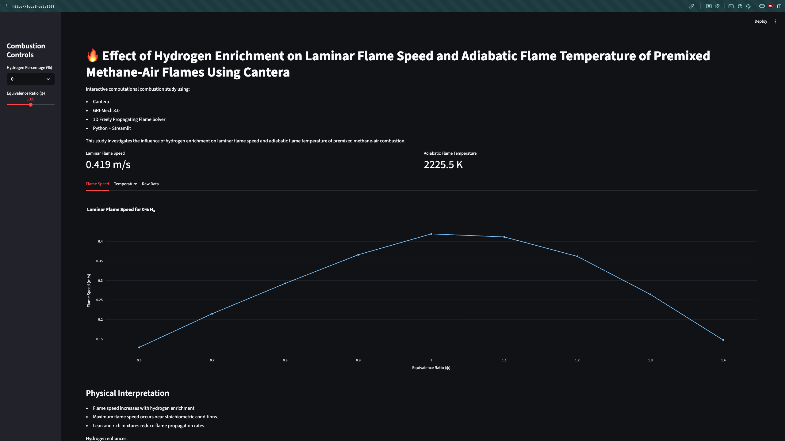
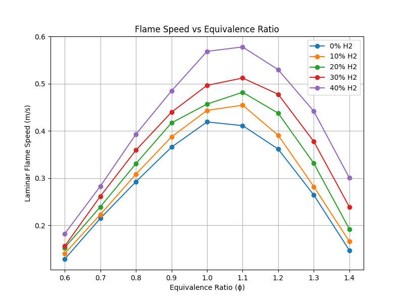
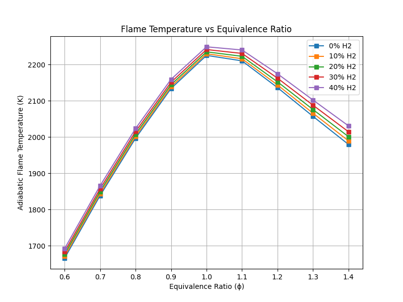

# Effect of Hydrogen Enrichment on Laminar Flame Speed and Adiabatic Flame Temperature of Premixed Methane-Air Flames Using Cantera

This project presents a computational investigation of hydrogen-enriched premixed methane-air combustion using Cantera and Python.

The study analyzes the effect of hydrogen blending on:

- Laminar Flame Speed
- Adiabatic Flame Temperature

under varying equivalence ratios using the GRI-Mech 3.0 chemical kinetics mechanism.

---

# 📘 Project Overview

Hydrogen enrichment has emerged as a promising pathway for improving combustion efficiency and reducing carbon emissions in future energy systems.

This project numerically investigates:
- methane-hydrogen premixed flames
- flame propagation behavior
- temperature variation
- combustion stability trends

using:
- Cantera
- Python
- Streamlit
- Plotly

---

# 🖥️ Dashboard Preview

Interactive Streamlit dashboard for combustion analysis and visualization.

<p align="center">
  
</p>

---

# ⚙️ Features

- 1D freely propagating flame simulations  
- Hydrogen fraction sweep (0–40%)  
- Equivalence ratio sweep (0.6–1.4)  
- Laminar flame speed analysis  
- Adiabatic flame temperature analysis  
- Interactive Streamlit dashboard  
- Research-paper-ready plots  

---

# 🧪 Simulation Conditions

| Parameter | Value |
|---|---|
| Pressure | 1 atm |
| Inlet Temperature | 300 K |
| Hydrogen Fraction | 0–40% |
| Equivalence Ratio | 0.6–1.4 |
| Mechanism | GRI-Mech 3.0 |

---

# 📊 Results

## Flame Speed

Hydrogen enrichment significantly increases laminar flame speed, especially near stoichiometric conditions.



---

## Flame Temperature

Adiabatic flame temperature increases moderately with hydrogen enrichment.



---

# 🚀 Installation

Clone the repository:

```bash
git clone https://github.com/YOUR_USERNAME/methane-hydrogen-combustion.git
```

Move into the project directory:

```bash
cd methane-hydrogen-combustion
```

Install dependencies:

```bash
pip install -r requirements.txt
```

---

# ▶️ Running the Simulation

Run the Cantera simulation:

```bash
python main.py
```

This generates:

```text
full_results.csv
```

---

# 🌐 Running the Interactive Dashboard

Launch Streamlit:

```bash
streamlit run app.py
```

The dashboard opens in your browser at:

```text
http://localhost:8501
```

---

# 📂 Repository Structure

```text
methane-hydrogen-combustion/
│
├── app.py
├── main.py
├── full_results.csv
├── requirements.txt
├── README.md
├── references.bib
├── paper.tex
│
├── figures/
│   ├── flame_speed.png
│   └── flame_temperature.png
```

---

# 📚 References

Key references used in this project include:

- GRI-Mech 3.0
- Cantera Documentation
- Hydrogen-enriched methane combustion studies
- Laminar flame speed investigations

---

# 👨‍🔬 Authors

- Omkar Das
- Suyash Trivedi
- Rutrank Tandon
- Uday Chaudhary
- Utkarsh Ashish Pandey

Department of Mechanical Engineering  
R. V. College of Engineering  
Bengaluru, India

---

# ⚠️ Disclaimer

This project is intended for educational and research purposes only.